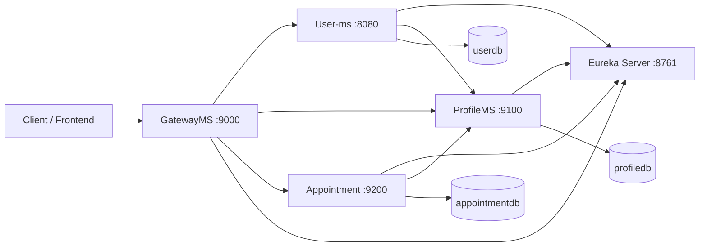

# Hospital Management System (HMS)

A microservices-based Hospital Management System built with **Spring Boot 3.5**, **Spring Cloud**, and **PostgreSQL**. The platform supports user authentication, doctor/patient profiles, appointment scheduling, medical records, and prescriptions—with role-based access enforced at the API gateway.

**Repository:** [https://github.com/shivamjg101/HMS](https://github.com/shivamjg101/HMS)

---

## Architecture



All external traffic goes through **GatewayMS** on port `9000`. Services register with **Eureka** for discovery; the gateway routes requests using load-balanced service names.

| Service        | Port | Database      | Responsibility                                      |
|----------------|------|---------------|-----------------------------------------------------|
| Eureka-Server  | 8761 | —             | Service discovery                                   |
| GatewayMS      | 9000 | —             | API gateway, JWT validation, role-based routing     |
| User-ms        | 8080 | `userdb`      | Authentication, registration, JWT issuance          |
| ProfileMS      | 9100 | `profiledb`   | Doctor and patient profiles                         |
| Appointment    | 9200 | `appointmentdb` | Appointments, records, prescriptions            |

---

## Tech Stack

- **Java 17**
- **Spring Boot 3.5.14**
- **Spring Cloud 2025.0** (Eureka, Gateway, OpenFeign)
- **Spring Security** + **JWT** (JJWT)
- **Spring Data JPA**
- **PostgreSQL**
- **Lombok**, **Maven**

---

## Features

- JWT-based authentication via the API gateway
- User roles: `PATIENT`, `DOCTOR`, `ADMIN`
- Public **patient** self-registration only (`POST /user/register`)
- **Doctor** registration restricted to **admin** (`POST /user/registerDoctor`)
- Admin self-registration is blocked on public endpoints
- Bootstrap **system admin** created on first startup
- Admins can register additional admins and doctors via protected endpoints
- Doctor/patient profile management
- Appointment scheduling, cancellation, and analytics
- Appointment reports, prescriptions, and medicine tracking

---

## Security Model

### Public endpoints (no JWT)

| Method | Path              |
|--------|-------------------|
| POST   | `/user/login`     |
| POST   | `/user/register`  |

### Admin-only endpoints

Require a valid JWT with role `ADMIN`:

| Method | Path                                      |
|--------|-------------------------------------------|
| POST   | `/user/registerDoctor`                    |
| POST   | `/user/registerAdmin`                     |
| GET    | `/user/getRegistrationCounts`             |
| POST   | `/profile/doctor/add`                     |
| GET    | `/profile/doctor/getAll`                  |
| GET    | `/profile/patient/getAll`                 |
| GET    | `/appointment/visitCount`                 |
| GET    | `/appointment/countReasons`             |
| GET    | `/appointment/report/getAllPrescriptions` |

### Authenticated endpoints

All other routes require `Authorization: Bearer <token>`. Admins can access every endpoint; doctors and patients follow the gateway rules above.

### Default system admin

On first startup, **User-ms** seeds a default admin if one does not exist:

| Field    | Value              |
|----------|--------------------|
| Email    | `admin@hms.local`  |
| Password | `Admin@123`        |

> Change these credentials in production. Additional admins can be created via `POST /user/registerAdmin`. Doctors can only be created by an admin via `POST /user/registerDoctor`.

---

## Prerequisites

- **JDK 17**
- **Maven 3.8+**
- **PostgreSQL** (three databases)
- **Git**

---

## Database Setup

Create three PostgreSQL databases:

```sql
CREATE DATABASE userdb;
CREATE DATABASE profiledb;
CREATE DATABASE appointmentdb;
```

Update credentials in each service's `application.yaml`:

- `User-ms/src/main/resources/application.yaml`
- `ProfileMS/src/main/resources/application.yaml`
- `Appointment/src/main/resources/application.yaml`

---

## Getting Started

### 1. Clone the repository

```bash
git clone https://github.com/shivamjg101/HMS.git
cd HMS
```

### 2. Start services (in order)

```bash
# Terminal 1 – Eureka
cd Eureka-Server
mvn spring-boot:run

# Terminal 2 – User service
cd User-ms
mvn spring-boot:run

# Terminal 3 – Profile service
cd ProfileMS
mvn spring-boot:run

# Terminal 4 – Appointment service
cd Appointment
mvn spring-boot:run

# Terminal 5 – API Gateway (start last)
cd GatewayMS
mvn spring-boot:run
```

### 3. Verify Eureka

Open [http://localhost:8761](http://localhost:8761) and confirm all four services are registered.

### 4. Use the API

Base URL (gateway): **`http://localhost:9000`**

#### Register a patient

```http
POST http://localhost:9000/user/register
Content-Type: application/json

{
  "Name": "John Doe",
  "email": "john@example.com",
  "password": "password123"
}
```

#### Register a doctor (admin only)

```http
POST http://localhost:9000/user/registerDoctor
Authorization: Bearer <admin-jwt>
Content-Type: application/json

{
  "Name": "Dr. Alice Smith",
  "email": "doctor1@hms.local",
  "password": "Doctor@123"
}
```

#### Login

```http
POST http://localhost:9000/user/login
Content-Type: application/json

{
  "email": "admin@hms.local",
  "password": "Admin@123"
}
```

Use the returned JWT for protected calls:

```http
Authorization: Bearer <your-jwt-token>
```

#### Register another admin (admin only)

```http
POST http://localhost:9000/user/registerAdmin
Authorization: Bearer <admin-jwt>
Content-Type: application/json

{
  "Name": "Another Admin",
  "email": "admin2@hms.local",
  "password": "SecurePass123"
}
```

---

## API Overview

### User (`/user/**`)

| Method | Path                    | Access        | Description                    |
|--------|-------------------------|---------------|--------------------------------|
| POST   | `/user/register`        | Public        | Register patient (self-signup) |
| POST   | `/user/login`           | Public        | Login, returns JWT             |
| POST   | `/user/registerDoctor`  | Admin         | Register doctor (user + profile) |
| POST   | `/user/registerAdmin`   | Admin         | Create a new admin user        |
| GET    | `/user/getProfile/{id}` | Authenticated | Get profile ID for a user      |
| GET    | `/user/getRegistrationCounts` | Admin   | Monthly registration stats     |

### Profile (`/profile/**`)

| Method | Path                         | Description              |
|--------|------------------------------|--------------------------|
| POST   | `/profile/doctor/add`        | Add doctor profile (admin) |
| GET    | `/profile/doctor/get/{id}`   | Get doctor by ID         |
| GET    | `/profile/doctor/getAll`     | List all doctors (admin) |
| POST   | `/profile/patient/add`       | Add patient profile      |
| GET    | `/profile/patient/get/{id}`  | Get patient by ID        |
| GET    | `/profile/patient/getAll`    | List all patients (admin)|

### Appointment (`/appointment/**`)

| Method | Path                                      | Description                    |
|--------|-------------------------------------------|--------------------------------|
| POST   | `/appointment/schedule`                   | Schedule appointment           |
| PUT    | `/appointment/cancel/{appointmentId}`     | Cancel appointment             |
| GET    | `/appointment/get/{appointmentId}`        | Get appointment details        |
| GET    | `/appointment/getAllByPatient/{patientId}`| Appointments by patient        |
| GET    | `/appointment/getAllByDoctor/{doctorId}`  | Appointments by doctor         |
| GET    | `/appointment/visitCount`                 | Visit statistics (admin)       |
| POST   | `/appointment/report/create`              | Create appointment report      |
| GET    | `/appointment/report/getRecordsByPatientId/{patientId}` | Patient records |

---

## Project Structure

```
HMS/
├── Eureka-Server/     # Service discovery
├── GatewayMS/         # API gateway + JWT + RBAC filter
├── User-ms/           # Users, auth, JWT
├── ProfileMS/         # Doctor & patient profiles
├── Appointment/       # Appointments, records, prescriptions
├── http/              # Ready-to-run .http API request files
└── README.md
```

---

## HTTP Request Files

The `http/` folder contains `.http` files for **VS Code REST Client** or **IntelliJ HTTP Client**. All requests go through the gateway at `http://localhost:9000`.

| File | Description |
|------|-------------|
| `00-workflow.http` | Full flow: login → register → add profiles → book appointment → create report |
| `01-user.http` | Login, register patient, register doctor/admin (admin), user endpoints |
| `02-profile.http` | Add/update/get doctors and patients |
| `03-appointment.http` | Book, cancel, list appointments and analytics |
| `04-reports.http` | Medical reports, prescriptions, medicines |

**How to use (VS Code):** Install the [REST Client](https://marketplace.visualstudio.com/items?itemName=humao.rest-client) extension, open any `.http` file, run **Login Admin** first, then click **Send Request** on other calls.

**How to use (IntelliJ):** Open any `.http` file and click the green run icon next to each request.

Each module is an independent Maven project with its own `pom.xml`.

---

## Environment Variables

| Variable            | Default                          | Used by        |
|---------------------|----------------------------------|----------------|
| `EUREKA_SERVER_URL` | `http://localhost:8761/eureka/`  | All services   |
| `PROFILEMS_URL`     | Gateway or direct profile URL    | User-ms, Appointment |
| `CORS_ALLOWED_ORIGINS` | `http://localhost:3000`       | Appointment    |

---

## CORS

Frontend origins are configured in each service's `application.yaml` under `app.cors.allowed-origins` (default includes `http://localhost:3000` and `http://localhost:4200`).

---

## Commit History

| Commit | Description                                      |
|--------|--------------------------------------------------|
| Initial | Original HMS microservices codebase           |
| Latest  | Admin RBAC, registration restrictions, bootstrap admin |

---

## License

This project is provided as-is for educational and development purposes.

---

## Author

[shivamjg101](https://github.com/shivamjg101)
